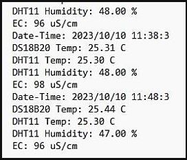

# SaltProductionMonitor

This project is an Arduino Uno-based measurement system for monitoring salt production processes. It measures and records real-time data on outdoor wind speed, temperature, humidity, brine pool water temperature, and conductivity, storing the information on an SD card.

## Features

- Real-time measurement and recording of:
  - Outdoor wind speed
  - Temperature
  - Humidity
  - Brine pool water temperature
  - Conductivity
- Data storage on SD card for later analysis
- Monitoring key parameters of the salt production process

## Hardware Requirements

- Arduino Uno
- Anemometer
- Temperature and humidity sensor
- Water temperature sensor
- Conductivity sensor
- SD card module

## Experiment Setup

The experiment setup includes an outdoor salt production site with various sensors set up around a brine pool. The scene includes an Arduino Uno connected to wind speed, temperature, humidity, water temperature, and conductivity sensors. Wires run from the sensors to the Arduino, which is housed in a protective casing. The brine pool is visible in the background with some salt crystals forming on the edges. The setup includes a small weather station and a laptop displaying real-time data charts.

## Data Recording

Data is recorded in real-time and stored on an SD card. The recorded data includes outdoor wind speed, temperature, humidity, brine pool water temperature, and conductivity. This data can be later analyzed to monitor the efficiency and progress of the salt production process.
